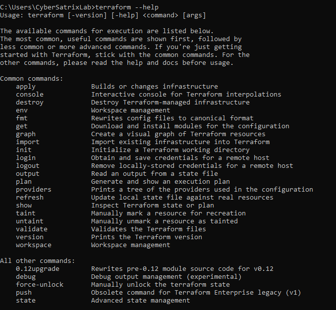

# Steps to Install Terraform 

## Windows
1. Download the Terraform application based on your respective OS and architecture from below 
 > [Download Terraform](https://www.terraform.io/downloads.html)
2. Terraform is distributed as a single binary package.
3. Install Terraform by unzipping it and moving it to your preferred directory.
4. Unzipped directory will consist of Binary <terraform.exe>.
5. To Run the terraform from any location in Command  Prompt, set the add the installed directory in the “System PATH”
   **For Windows**
   - Open Control Panel and go to System and Security>System. Alternatively, just type the following in the address bar in File Explorer.
     `Control Panel\System and Security\System`
   - Click `Advanced System Settings` on the windows which appears
   - On the System Properties screen, go to the `Advanced tab`
   - Click the `Environment Variables` button at the very bottom. On the Environment Variables window, select `Path` from the User             `variables` section and click Edit.
   - On the `Edit Environment variable` window, click the `New` button
   - Once it’s active, click the `Browse` button and navigate to the folder of `Terraform.exe` Bindary and add it to Path environment          variables is.
   
## MAC/Linux**
1. Navigate to the preferred directory, to install the Terraform
```
   cd /home/ubuntu
```
2. Downloading terraform in the above path using `wget` command
```
   wget https://releases.hashicorp.com/terraform/0.9.8/terraform_0.9.8_linux_amd64.zip
```
3. Unzip the file in the same location, using below command
```
   In MAC use command `brew install terraform`
```
```
   unzip terraform_0.12.18_linux_amd64.zip
```
4. Create a directory "Terraform" in path `/home/ubuntu` and move the binary package into the directory
```
   mkdir Terraform
   sudo mv terraform Terraform/
```
5. set the variable in the PATH. I have a `.profile` shell environment in `/home/ubuntu` path. Thus setting PATH on the same shell environment.
```
   In the path `/home/ubuntu`, open the shell environment using your preferred editor
   - vi .profile
   in the `.profile` sheell, add the below line at the bottom 
   - export PATH="$PATH:/home/ubuntu/Terraform"
   - source /profile
```
 Now you can access the terraform from any directory

### Validation

Type the below command from any directory/path and you should view thw twerraform help 
```
   terraform --help
```

